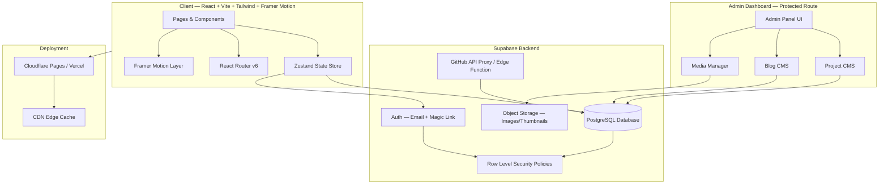
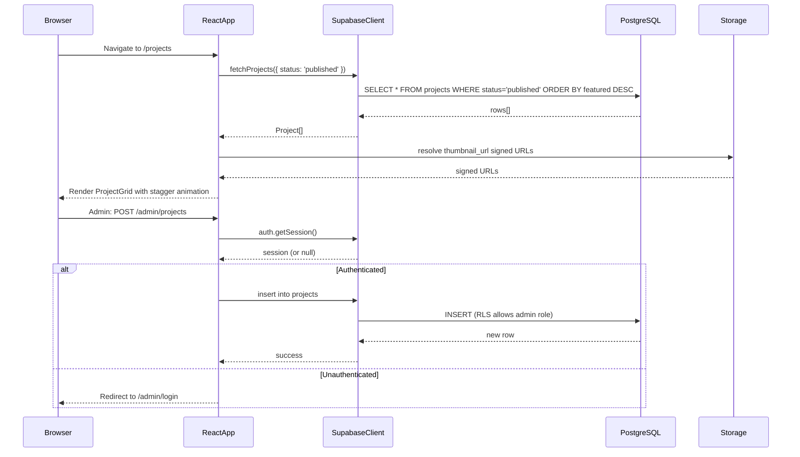
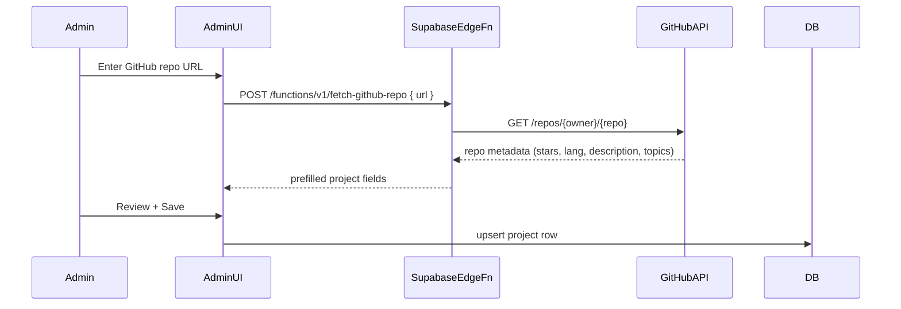
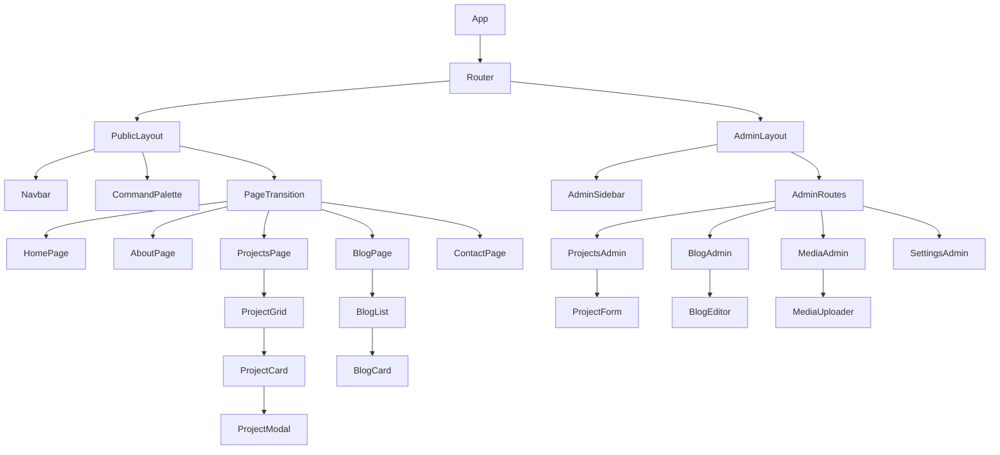
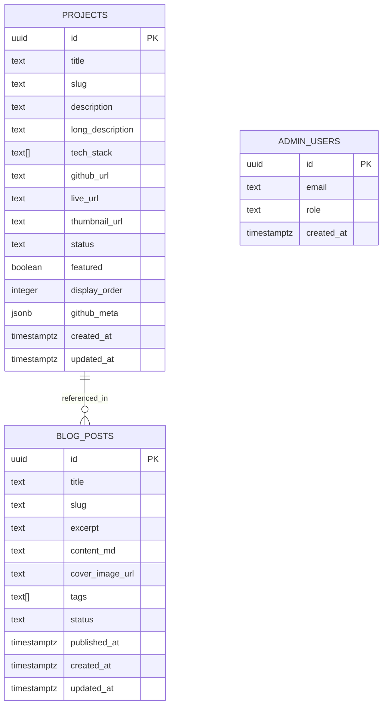

# Design Document: Portfolio V2 Rebuild

## Overview

Portfolio V2 is a ground-up rebuild of an existing Vue/Vite developer portfolio, evolving it from a static, hardcoded presentation into a dynamic, database-driven developer platform. The new stack — React, Vite, Tailwind CSS, Framer Motion, and Supabase — replaces the current Vue + static content approach, delivering a premium, cinematic developer experience inspired by Vercel, Linear, and Raycast.

The platform introduces a Supabase-backed content layer for projects, blog posts, and media assets, paired with an auth-protected admin dashboard for full CMS control. The visual identity retains the existing terminal/developer aesthetic while elevating it with smooth microinteractions, stagger animations, and a dark-first design system. The result is a scalable, maintainable platform that grows with the developer's career.

The migration path is intentional: the existing five pages (Home, About, Projects, Vision, Contact) map directly to new React equivalents, preserving content while replacing the architecture. The pink accent (`#FF7EB9`) and typographic personality are carried forward as design tokens, not discarded.

---

## Architecture

### System Overview



### Data Flow



### GitHub Auto-Fetch Flow



---

## Components and Interfaces

### Component Tree



### Core Component Interfaces

```typescript
// ─── Layout ───────────────────────────────────────────────────────────────────

interface NavbarProps {
  transparent?: boolean        // true on hero, false on scroll
}

interface PageTransitionProps {
  children: React.ReactNode
  key: string                  // route key for AnimatePresence
}

// ─── Project Components ───────────────────────────────────────────────────────

interface ProjectCardProps {
  project: Project
  index: number                // stagger delay = index * 0.08s
  onExpand: (id: string) => void
}

interface ProjectModalProps {
  project: Project | null
  isOpen: boolean
  onClose: () => void
}

interface ProjectGridProps {
  projects: Project[]
  filter?: ProjectFilter
  isLoading: boolean
}

// ─── Blog Components ──────────────────────────────────────────────────────────

interface BlogCardProps {
  post: BlogPost
  index: number
}

// ─── Command Palette ──────────────────────────────────────────────────────────

interface CommandPaletteProps {
  isOpen: boolean
  onClose: () => void
  commands: Command[]
}

interface Command {
  id: string
  label: string
  description?: string
  icon?: string
  action: () => void
  keywords: string[]
}

// ─── Admin Components ─────────────────────────────────────────────────────────

interface ProjectFormProps {
  project?: Project            // undefined = create mode
  onSave: (data: ProjectInput) => Promise<void>
  onCancel: () => void
}

interface MediaUploaderProps {
  bucket: 'thumbnails' | 'blog-images'
  onUpload: (url: string) => void
  accept?: string
  maxSizeMB?: number
}
```

---

## Data Models

### Database Schema



### TypeScript Type Definitions

```typescript
// ─── Domain Types ─────────────────────────────────────────────────────────────

type ProjectStatus = 'draft' | 'published' | 'archived'
type BlogStatus = 'draft' | 'published'
type AdminRole = 'admin' | 'editor'

interface Project {
  id: string
  title: string
  slug: string
  description: string
  long_description?: string
  tech_stack: string[]
  github_url?: string
  live_url?: string
  thumbnail_url?: string
  status: ProjectStatus
  featured: boolean
  display_order: number
  github_meta?: GitHubMeta
  created_at: string
  updated_at: string
}

interface GitHubMeta {
  stars: number
  forks: number
  language: string
  topics: string[]
  last_pushed: string
  open_issues: number
}

interface BlogPost {
  id: string
  title: string
  slug: string
  excerpt: string
  content_md: string
  cover_image_url?: string
  tags: string[]
  status: BlogStatus
  published_at?: string
  created_at: string
  updated_at: string
}

interface ProjectInput {
  title: string
  slug: string
  description: string
  long_description?: string
  tech_stack: string[]
  github_url?: string
  live_url?: string
  thumbnail_url?: string
  status: ProjectStatus
  featured: boolean
  display_order: number
}

type ProjectFilter = 'all' | 'featured' | string  // string = tech tag filter
```

### Supabase RLS Policies

```sql
-- Projects: public read for published, admin write
CREATE POLICY "public_read_published_projects"
  ON projects FOR SELECT
  USING (status = 'published');

CREATE POLICY "admin_full_access_projects"
  ON projects FOR ALL
  USING (auth.jwt() ->> 'role' = 'admin');

-- Blog: public read for published, admin write
CREATE POLICY "public_read_published_posts"
  ON blog_posts FOR SELECT
  USING (status = 'published');

CREATE POLICY "admin_full_access_blog"
  ON blog_posts FOR ALL
  USING (auth.jwt() ->> 'role' = 'admin');
```

---

## Algorithmic Pseudocode

### Project Fetch with Caching

```pascal
PROCEDURE fetchProjects(filter: ProjectFilter): Project[]
  INPUT: filter — 'all' | 'featured' | tag string
  OUTPUT: sorted, filtered Project array

  PRECONDITIONS:
    - Supabase client is initialized
    - filter is a valid ProjectFilter value

  POSTCONDITIONS:
    - Returns only published projects (RLS enforced)
    - Featured projects appear first
    - Result is sorted by display_order ASC within each group

  SEQUENCE
    cacheKey ← 'projects:' + filter
    cached ← queryCache.get(cacheKey)

    IF cached IS NOT NULL AND cached.age < 60_000ms THEN
      RETURN cached.data
    END IF

    query ← supabase
      .from('projects')
      .select('*')
      .eq('status', 'published')
      .order('featured', { ascending: false })
      .order('display_order', { ascending: true })

    IF filter = 'featured' THEN
      query ← query.eq('featured', true)
    ELSE IF filter ≠ 'all' THEN
      query ← query.contains('tech_stack', [filter])
    END IF

    { data, error } ← AWAIT query

    IF error IS NOT NULL THEN
      LOG error
      RETURN []
    END IF

    queryCache.set(cacheKey, { data, age: now() })
    RETURN data
  END SEQUENCE
END PROCEDURE
```

### GitHub Repo Auto-Fetch (Edge Function)

```pascal
PROCEDURE fetchGitHubMeta(repoUrl: string): GitHubMeta
  INPUT: repoUrl — full GitHub URL e.g. https://github.com/owner/repo
  OUTPUT: GitHubMeta object or error

  PRECONDITIONS:
    - repoUrl matches pattern https://github.com/{owner}/{repo}
    - GITHUB_TOKEN env var is set in Supabase Edge Function secrets

  POSTCONDITIONS:
    - Returns normalized GitHubMeta
    - Rate limit headers are respected (429 → throw RateLimitError)

  SEQUENCE
    { owner, repo } ← parseGitHubUrl(repoUrl)

    IF owner IS NULL OR repo IS NULL THEN
      THROW InvalidUrlError("Could not parse GitHub URL")
    END IF

    response ← AWAIT fetch(
      'https://api.github.com/repos/' + owner + '/' + repo,
      { headers: { Authorization: 'Bearer ' + GITHUB_TOKEN } }
    )

    IF response.status = 404 THEN
      THROW NotFoundError("Repository not found")
    END IF

    IF response.status = 429 THEN
      THROW RateLimitError("GitHub API rate limit exceeded")
    END IF

    IF response.status ≠ 200 THEN
      THROW ApiError("GitHub API error: " + response.status)
    END IF

    raw ← AWAIT response.json()

    RETURN {
      stars:       raw.stargazers_count,
      forks:       raw.forks_count,
      language:    raw.language,
      topics:      raw.topics,
      last_pushed: raw.pushed_at,
      open_issues: raw.open_issues_count
    }
  END SEQUENCE
END PROCEDURE
```

### Command Palette Search

```pascal
PROCEDURE searchCommands(query: string, commands: Command[]): Command[]
  INPUT: query — user typed string (may be empty)
         commands — full command registry
  OUTPUT: ranked Command[] (max 8 results)

  PRECONDITIONS:
    - commands is non-empty array
    - query length ≤ 100 characters

  POSTCONDITIONS:
    - Returns at most 8 results
    - Empty query returns top-level navigation commands only
    - Results are ranked by relevance score DESC

  SEQUENCE
    IF query = '' OR query.trim() = '' THEN
      RETURN commands.filter(c => c.type = 'navigation').slice(0, 8)
    END IF

    normalizedQuery ← query.toLowerCase().trim()
    scored ← []

    FOR each command IN commands DO
      score ← 0

      IF command.label.toLowerCase().startsWith(normalizedQuery) THEN
        score ← score + 100
      ELSE IF command.label.toLowerCase().includes(normalizedQuery) THEN
        score ← score + 60
      END IF

      FOR each keyword IN command.keywords DO
        IF keyword.includes(normalizedQuery) THEN
          score ← score + 30
        END IF
      END FOR

      IF command.description.toLowerCase().includes(normalizedQuery) THEN
        score ← score + 20
      END IF

      IF score > 0 THEN
        scored.push({ command, score })
      END IF
    END FOR

    sorted ← scored.sortBy(item => item.score, DESCENDING)
    RETURN sorted.map(item => item.command).slice(0, 8)
  END SEQUENCE
END PROCEDURE
```

### Admin Auth Guard

```pascal
PROCEDURE requireAdminAuth(navigate: NavigateFn): boolean
  INPUT: navigate — React Router navigate function
  OUTPUT: true if authenticated, false + redirect if not

  PRECONDITIONS:
    - Supabase auth client is initialized

  POSTCONDITIONS:
    - If session exists and role = 'admin' → returns true
    - If no session → redirects to /admin/login, returns false
    - If session but wrong role → redirects to /, returns false

  SEQUENCE
    session ← AWAIT supabase.auth.getSession()

    IF session IS NULL THEN
      navigate('/admin/login', { replace: true })
      RETURN false
    END IF

    userRole ← session.user.user_metadata.role

    IF userRole ≠ 'admin' THEN
      navigate('/', { replace: true })
      RETURN false
    END IF

    RETURN true
  END SEQUENCE
END PROCEDURE
```

### Stagger Animation Orchestration

```pascal
PROCEDURE buildStaggerVariants(count: integer, baseDelay: float): AnimationVariants
  INPUT: count — number of items to stagger
         baseDelay — delay increment per item in seconds (default 0.08)
  OUTPUT: Framer Motion variants object

  PRECONDITIONS:
    - count > 0
    - baseDelay > 0 AND baseDelay ≤ 0.3

  POSTCONDITIONS:
    - Returns variants with container + item definitions
    - Total animation duration ≤ count * baseDelay + 0.4s

  SEQUENCE
    containerVariants ← {
      hidden: { opacity: 0 },
      visible: {
        opacity: 1,
        transition: {
          staggerChildren: baseDelay,
          delayChildren: 0.1
        }
      }
    }

    itemVariants ← {
      hidden: { opacity: 0, y: 20 },
      visible: {
        opacity: 1,
        y: 0,
        transition: {
          duration: 0.4,
          ease: [0.25, 0.46, 0.45, 0.94]
        }
      }
    }

    RETURN { containerVariants, itemVariants }
  END SEQUENCE
END PROCEDURE
```

---

## Key Functions with Formal Specifications

### `useProjects` Hook

```typescript
function useProjects(filter?: ProjectFilter): {
  projects: Project[]
  isLoading: boolean
  error: string | null
  refetch: () => void
}
```

**Preconditions:**
- Supabase client is initialized and accessible via context
- `filter` is a valid `ProjectFilter` value or `undefined` (defaults to `'all'`)

**Postconditions:**
- `projects` contains only `status = 'published'` rows (enforced by RLS)
- `isLoading` is `true` during fetch, `false` after resolution
- `error` is `null` on success, error message string on failure
- `refetch()` invalidates cache and re-fetches

**Loop Invariants:** N/A (async hook, no loops)

---

### `useCommandPalette` Hook

```typescript
function useCommandPalette(): {
  isOpen: boolean
  open: () => void
  close: () => void
  toggle: () => void
  query: string
  setQuery: (q: string) => void
  results: Command[]
}
```

**Preconditions:**
- Command registry is populated before first open
- Keyboard shortcut listener (`Cmd+K` / `Ctrl+K`) is registered on mount

**Postconditions:**
- `isOpen` toggles correctly on `open()`, `close()`, `toggle()`
- `results` is recomputed on every `query` change via `searchCommands()`
- `close()` resets `query` to `''`
- Body scroll is locked when `isOpen = true`

---

### `uploadMedia` Function

```typescript
async function uploadMedia(
  file: File,
  bucket: 'thumbnails' | 'blog-images',
  options?: { maxSizeMB?: number; quality?: number }
): Promise<{ url: string; path: string }>
```

**Preconditions:**
- `file` is a valid `File` object (image/png, image/jpeg, image/webp)
- `file.size` ≤ `(options.maxSizeMB ?? 5) * 1024 * 1024`
- Admin session is active (RLS enforces storage write)

**Postconditions:**
- Returns public URL and storage path on success
- File is stored under `{bucket}/{userId}/{timestamp}-{filename}`
- Throws `FileTooLargeError` if size exceeds limit
- Throws `InvalidFileTypeError` if MIME type is not an image

---

### `generateSlug` Function

```typescript
function generateSlug(title: string): string
```

**Preconditions:**
- `title` is a non-empty string

**Postconditions:**
- Returns lowercase, hyphen-separated slug
- All non-alphanumeric characters (except hyphens) are removed
- Multiple consecutive hyphens are collapsed to one
- Leading/trailing hyphens are stripped
- Result is URL-safe

**Example:** `"Smart RC Car (v2)"` → `"smart-rc-car-v2"`

---

### `resolveProjectThumbnail` Function

```typescript
function resolveProjectThumbnail(
  project: Project,
  fallbackUrl?: string
): string
```

**Preconditions:**
- `project` is a valid `Project` object

**Postconditions:**
- Returns `project.thumbnail_url` if it is a non-empty string
- Returns `fallbackUrl` if provided and `thumbnail_url` is absent
- Returns a default placeholder URL if neither is available
- Never returns `null` or `undefined`

---

## Example Usage

### Fetching and Rendering Projects

```typescript
// ProjectsPage.tsx
function ProjectsPage() {
  const [filter, setFilter] = useState<ProjectFilter>('all')
  const { projects, isLoading, error } = useProjects(filter)
  const { containerVariants, itemVariants } = buildStaggerVariants(projects.length, 0.08)

  if (isLoading) return <ProjectGridSkeleton count={6} />
  if (error) return <ErrorState message={error} />

  return (
    <motion.div
      variants={containerVariants}
      initial="hidden"
      animate="visible"
    >
      <FilterBar active={filter} onChange={setFilter} />
      {projects.map((project, i) => (
        <motion.div key={project.id} variants={itemVariants}>
          <ProjectCard project={project} index={i} onExpand={openModal} />
        </motion.div>
      ))}
    </motion.div>
  )
}
```

### Admin Project Creation

```typescript
// AdminProjectForm.tsx
async function handleSave(formData: ProjectInput) {
  const slug = generateSlug(formData.title)
  const { error } = await supabase
    .from('projects')
    .insert({ ...formData, slug })

  if (error) {
    toast.error('Failed to save project')
    return
  }
  toast.success('Project saved')
  navigate('/admin/projects')
}
```

### Command Palette Registration

```typescript
// useAppCommands.ts
function useAppCommands() {
  const navigate = useNavigate()

  return [
    {
      id: 'nav-home',
      label: 'Go to Home',
      icon: 'home',
      action: () => navigate('/'),
      keywords: ['home', 'start', 'hero'],
      type: 'navigation'
    },
    {
      id: 'nav-projects',
      label: 'View Projects',
      icon: 'folder',
      action: () => navigate('/projects'),
      keywords: ['projects', 'work', 'portfolio'],
      type: 'navigation'
    },
    {
      id: 'theme-toggle',
      label: 'Toggle Theme',
      icon: 'sun',
      action: () => toggleTheme(),
      keywords: ['dark', 'light', 'theme', 'mode'],
      type: 'action'
    }
  ]
}
```

---

## Correctness Properties

- For all projects `p` returned by `fetchProjects()`: `p.status === 'published'`
- For all `generateSlug(title)` results `s`: `s` matches `/^[a-z0-9]+(-[a-z0-9]+)*$/`
- For all `searchCommands(query, commands)` results: `results.length ≤ 8`
- For all `uploadMedia(file)` calls where `file.size > maxSizeMB * 1024 * 1024`: throws `FileTooLargeError`
- For all `resolveProjectThumbnail(project)` calls: return value is a non-empty string
- For all admin route renders where `session === null`: user is redirected to `/admin/login`
- For all `buildStaggerVariants(count, delay)` calls: total animation duration ≤ `count * delay + 0.4`
- For all `useCommandPalette()` instances: `close()` always resets `query` to `''`

---

## Error Handling

### Error Scenarios

| Scenario | Condition | Response | Recovery |
|---|---|---|---|
| Supabase fetch failure | Network error or DB timeout | Show `ErrorState` component with retry button | `refetch()` on user action |
| GitHub API 404 | Repo not found or private | Toast: "Repository not found or private" | User corrects URL |
| GitHub rate limit | 429 from GitHub API | Toast: "Rate limit hit, try again in 1 hour" | Retry after cooldown |
| Image upload too large | `file.size > maxSizeMB` | Toast: "File exceeds 5MB limit" | User selects smaller file |
| Invalid file type | Non-image MIME type | Toast: "Only PNG, JPEG, WebP allowed" | User selects correct file |
| Unauthenticated admin access | No session on `/admin/*` | Redirect to `/admin/login` | User logs in |
| Slug collision | Duplicate slug on insert | Toast: "A project with this slug already exists" | User modifies title |
| Command palette empty | No results for query | Show "No results for '{query}'" empty state | User refines query |

---

## Testing Strategy

### Unit Testing Approach

Test pure utility functions in isolation using Vitest:
- `generateSlug()` — property tests covering special characters, unicode, edge cases
- `searchCommands()` — ranking correctness, empty query behavior, max 8 results
- `buildStaggerVariants()` — output shape, delay calculations
- `resolveProjectThumbnail()` — fallback chain correctness

### Property-Based Testing Approach

**Property Test Library**: fast-check (Vitest integration)

Key properties to verify:
- `generateSlug` is idempotent: `generateSlug(generateSlug(t)) === generateSlug(t)` for all strings `t`
- `searchCommands` never returns more than 8 results for any query
- `resolveProjectThumbnail` never returns null/undefined for any valid Project input
- `buildStaggerVariants` total duration is always bounded by `count * delay + 0.4`

### Integration Testing Approach

- Supabase RLS policies: verify unauthenticated reads return only published rows
- Admin auth guard: verify redirect behavior for unauthenticated and non-admin sessions
- Project CRUD flow: create → read → update → delete via Supabase test client
- Media upload: verify file stored at correct path and public URL resolves

---

## Performance Considerations

- **Query caching**: 60-second in-memory cache for project/blog fetches to avoid redundant Supabase calls on navigation
- **Image optimization**: Supabase Storage transform API for responsive thumbnails (`?width=400&quality=80`)
- **Code splitting**: React lazy + Suspense for admin routes — admin bundle is never loaded by public visitors
- **Animation performance**: All Framer Motion animations use `transform` and `opacity` only (GPU-composited, no layout thrash)
- **Font loading**: Preload critical fonts; use `font-display: swap` for fallback
- **Skeleton screens**: `ProjectGridSkeleton` and `BlogListSkeleton` prevent layout shift during data fetches

---

## Security Considerations

- **RLS enforcement**: All Supabase tables have Row Level Security enabled; public reads are scoped to `status = 'published'` only
- **Admin role via JWT**: Admin role is stored in `user_metadata` and validated server-side via RLS policy `auth.jwt() ->> 'role' = 'admin'`
- **No secrets in client**: GitHub token is stored in Supabase Edge Function secrets, never exposed to the browser
- **Input sanitization**: Blog post markdown is sanitized before rendering (DOMPurify or equivalent) to prevent XSS
- **CORS**: Supabase project CORS is restricted to the production domain
- **Storage policies**: Supabase Storage bucket policies restrict public read to `thumbnails` bucket only; `blog-images` requires auth for write

---

## Migration Plan

### From Vue V1 → React V2

| V1 (Current) | V2 (Target) | Notes |
|---|---|---|
| `Home.vue` | `HomePage.tsx` | Retain typographic layout, replace with React + Framer Motion |
| `About.vue` | `AboutPage.tsx` | Static content, add scroll-triggered animations |
| `Projects.vue` (hardcoded) | `ProjectsPage.tsx` (Supabase) | Full dynamic replacement |
| `Vision.vue` | `VisionPage.tsx` | Static content page |
| `Contact.vue` | `ContactPage.tsx` | Add contact form with Supabase or Resend |
| `BottomBar.vue` | `Navbar.tsx` | Redesign as top nav + mobile bottom bar |
| `Frame.vue` | `PageLayout.tsx` | Generalized layout wrapper |
| — | `BlogPage.tsx` | New page |
| — | `AdminLayout.tsx` + admin routes | New feature |
| — | `CommandPalette.tsx` | New feature |

### Design Token Continuity

```typescript
// tokens.ts — preserved from V1
export const tokens = {
  accent: '#FF7EB9',
  accentHover: '#e056a0',
  accentSubtle: 'rgba(255, 126, 185, 0.1)',
  bg: {
    primary: '#0a0a0a',    // dark-first (new)
    secondary: '#111111',
    surface: '#1a1a1a',
    border: '#2a2a2a'
  },
  text: {
    primary: '#f0f0f0',
    secondary: '#888888',
    muted: '#555555'
  },
  font: {
    sans: '"Inter", "Montserrat", sans-serif',
    mono: '"JetBrains Mono", "Fira Code", monospace'
  }
}
```

---

## Dependencies

| Package | Version | Purpose |
|---|---|---|
| `react` | ^18.3 | UI framework |
| `react-dom` | ^18.3 | DOM renderer |
| `react-router-dom` | ^6.x | Client-side routing |
| `vite` | ^5.x | Build tool |
| `@vitejs/plugin-react` | ^4.x | Vite React plugin |
| `tailwindcss` | ^3.x | Utility CSS |
| `framer-motion` | ^11.x | Animations |
| `@supabase/supabase-js` | ^2.x | Backend client |
| `zustand` | ^4.x | Lightweight state management |
| `@radix-ui/react-*` | latest | Accessible UI primitives (Shadcn base) |
| `lucide-react` | latest | Icon set |
| `react-hot-toast` | ^2.x | Toast notifications |
| `dompurify` | ^3.x | Markdown XSS sanitization |
| `fast-check` | ^3.x | Property-based testing |
| `vitest` | ^1.x | Test runner |
| `@testing-library/react` | ^14.x | Component testing |
