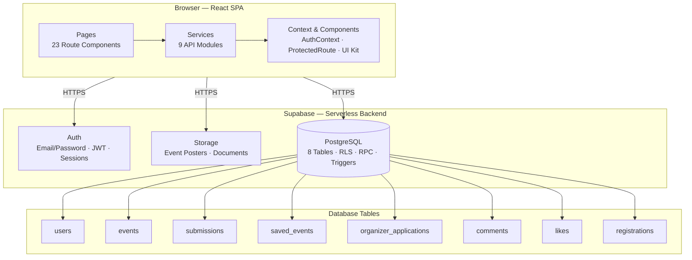

# MELA

**Centralized University Event Discovery Platform**

MELA connects students with academic, professional, cultural, and extracurricular events across multiple universities. It solves the problem of fragmented event communication by providing a single hub for discovering, registering for, and engaging with opportunities.

## Tech Stack

| Layer | Technology |
|-------|------------|
| Frontend | React 18, Vite, React Router 6, Tailwind CSS |
| Backend | Supabase (Auth, PostgreSQL, Storage, RLS) |
| Animation | Framer Motion |
| Icons | Lucide React |

## Architecture



## User Roles

- **Student** — Browse, register, save, like, comment on events
- **Moderator** — Manage events for assigned universities
- **Advisor** — Oversee events, approve submissions
- **Admin** — Manage users, approve organizers, full control

## Event Workflow

```
Student submits event → Pending (submissions table)
  → Moderator/Admin reviews
    → Approved → Published (events table)
    → Rejected → Reason provided
```

## Getting Started

```bash
# Install dependencies
npm run install:all

# Set up Supabase
# Add VITE_SUPABASE_URL and VITE_SUPABASE_ANON_KEY to frontend/.env

# Run schema in Supabase SQL Editor
# backend/supabase-schema.sql

# Start dev server
npm run dev

# Seed sample data
npm run seed
```

## Database

8 tables with Row Level Security (RLS) enforcing role-based access:
`users`, `events`, `submissions`, `saved_events`, `organizer_applications`, `comments`, `likes`, `registrations`

## Project Structure

```
Mela/
├── frontend/         # React SPA
│   └── src/
│       ├── pages/          # Route components
│       ├── services/       # Supabase data layer
│       ├── components/     # Layout + UI kit
│       ├── context/        # AuthContext
│       ├── config/         # Supabase client
│       └── utils/          # Constants, helpers
├── backend/          # Supabase schema (SQL)
├── seed/             # Dev data scripts
└── package.json      # Root orchestrator
```

See [PROJECT.md](./PROJECT.md) for full project specifications.
